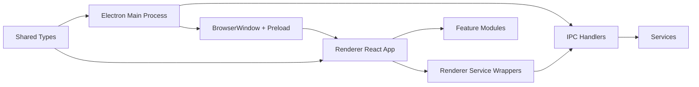

# Amethyst Architecture

This document describes the current architecture of Amethyst as of `v0.2.0`.

## Goals of the current architecture

The current structure is optimized for:

- a clear separation between native capabilities and UI code
- safe renderer access through preload + IPC
- room to grow into settings, themes, notes, and future plugin support
- small feature modules that can evolve independently

## High-level overview



## Main process

Location: `electron/`

Responsibilities:

- boot the application
- define app paths
- create the native window
- register IPC handlers
- own native capabilities such as filesystem-backed settings
- load built-in theme definitions

Important files:

- `electron/main.ts` — application entry point
- `electron/window/createWindow.ts` — `BrowserWindow` creation
- `electron/ipc/*.ts` — IPC channel registration
- `electron/services/*.ts` — native-side services

### Why this separation matters

The main process should stay focused on native concerns. It should not contain renderer UI logic, and renderer code should not access Node.js APIs directly.

## Preload bridge

Location: `electron/preload.mts`

Responsibilities:

- expose a minimal API on `window.amethyst`
- forward renderer requests to `ipcRenderer.invoke(...)`
- keep the renderer without direct Node access

Current exposed APIs:

- `window.amethyst.settings.*`
- `window.amethyst.themes.*`

This is the security boundary between UI code and native code.

## Renderer

Location: `src/`

Responsibilities:

- render the UI
- manage feature-level state
- host the editor and workspace layout
- provide Markdown preview rendering
- call main-process functionality only through typed service wrappers

Important areas:

- `src/app/` — app bootstrap and root component
- `src/layout/` — shell and panel composition
- `src/features/` — feature modules like editor, preview, sidebar, workspace, right panel
- `src/services/` — wrappers over `window.amethyst`
- `src/styles/` — global CSS and layout styles

## Shared contract

Location: `shared/`

Responsibilities:

- define types used by both the main process and renderer
- keep IPC payloads and settings/theme models aligned

Current examples:

- `shared/types/settings.type.ts`
- `shared/types/themes.type.ts`

This folder becomes more important as the app grows.

## Current feature layout

### Editor

- `src/features/editor/`
- contains the CodeMirror integration and editor-specific logic

### Preview

- (new in v0.2.0)
- handles Markdown rendering from the editor content
- currently operates as a separate mode (not split view yet)

### Workspace

- `src/features/workspace/`
- currently owns the editor/preview mode state and placeholder note content

### Sidebar and right panel

- `src/features/sidebar/`
- `src/features/right-panel/`
- currently placeholders for future notebook and outline/navigation functionality

### Panels

- `src/layout/WorkspacePanels.tsx`
- composes the three-panel workspace with `react-resizable-panels`

## Settings flow

Current flow:

1. App starts in the Electron main process.
2. `loadSettings()` reads `settings.json` from Electron `userData`.
3. Renderer asks for settings through `window.amethyst.settings`.
4. Main process returns or updates the in-memory settings and persists changes to disk.

Current storage file:

- `userData/settings.json`

Current settings model:

- theme selection
- autosave flag

### Recommended next evolution

As the app grows, move from a flat settings object to grouped sections such as:

```json
{
    "general": {},
    "editor": {},
    "appearance": {},
    "layout": {}
}
```

That will make the settings page and migration logic much cleaner.

## Theme flow

Current flow:

1. Renderer requests a theme by id.
2. Main process loads the matching JSON theme file.
3. Renderer applies theme tokens as CSS custom properties.

Current theme source:

- `electron/themes/amethyst-dark.json`
- `electron/themes/amethyst-light.json`

This is a good foundation for future custom themes because the runtime already works with token objects instead of hardcoded colors.

## What is intentionally missing in v0.2.0

To keep development focused, these concerns are not fully implemented yet:

- note storage model
- notebook model
- split-view synchronization (editor + preview)
- search indexing
- outline parsing
- settings UI
- command/shortcut system
- note title bar (in progress)

## Suggested architecture direction for upcoming versions

### v0.2–v0.3

- Expand preview capabilities
- Introduce split-view (editor + preview side-by-side)
- Improve synchronization between editor and preview

### v0.4–v0.5

Introduce a note domain layer, probably split into:

- note repository / filesystem service on the main process
- IPC channels for note operations
- renderer-side note store/hooks

### v0.6+

Add dedicated modules for:

- search indexing
- recent notes
- layout persistence
- commands and shortcuts

## Notes on release packaging

Packaging is currently driven from the `build` section in `package.json` using `electron-builder`.

Current targets:

- Windows: NSIS installer, portable executable
- macOS: DMG
- Linux: AppImage, DEB, RPM
