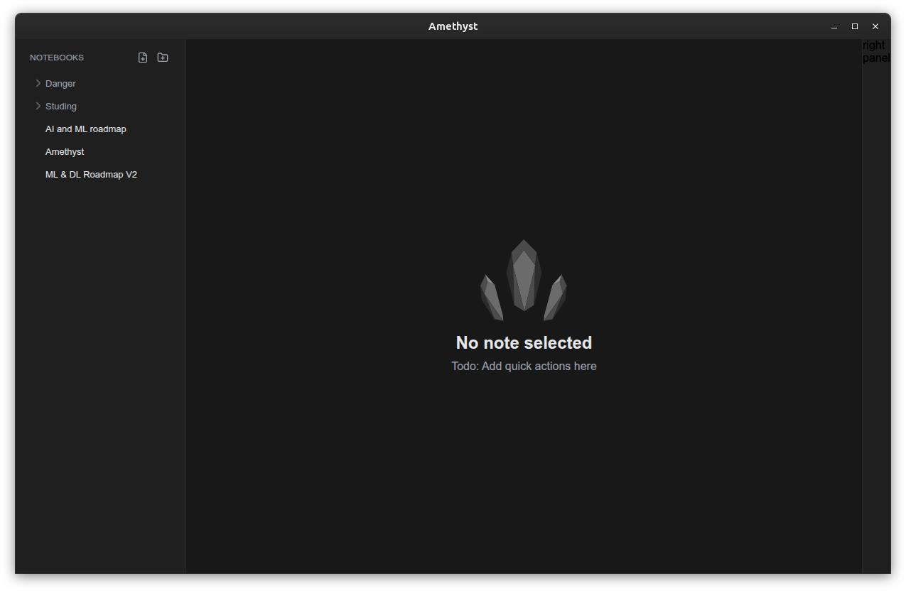
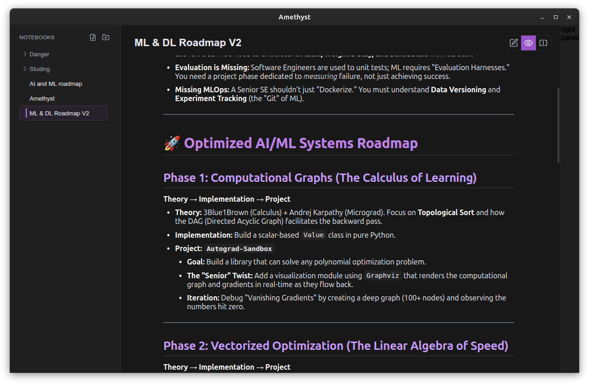

# 💎 Amethyst


A streamlined, architecture-first Markdown note-taking desktop application built with **Electron, React, Vite, and TypeScript**.

Amethyst is currently in active early development. The latest `v0.3.0` milestone solidifies the core editor foundation and introduces an initial Markdown preview workflow.

## 🚀 Current Status (`v0.3.0`)

What currently works:

- **Core App:** Electron desktop shell with a React/Vite renderer.
- **Editor:** CodeMirror 6 integration.
- **Preview:** Live Markdown-to-HTML rendering.
- **Layout:** Resizable left/center/right workspace panels with a split editor/preview view mode.
- **Theming:** Built-in dark and light theme loading via CSS variables and JSON.
- **Infrastructure:** Settings persistence and GitHub Actions CI with a tagged release workflow.

_See [ROADMAP.md](./ROADMAP.md) for what is currently in progress (v0.4.0 Notebook & Tree View) and what is planned for the road to 1.0.0._

## 📸 Screenshots




## 🛠️ Tech Stack

| Layer         | Technology                  |
| ------------- | --------------------------- |
| Desktop Shell | Electron                    |
| Renderer      | React                       |
| Build Tool    | Vite                        |
| Language      | TypeScript                  |
| Editor        | CodeMirror 6                |
| Layout        | react-resizable-panels      |
| Styling       | CSS variables + JSON themes |
| Packaging     | electron-builder            |

## 📂 Project Structure

```text
amethyst/
├── assets/                # Icons and packaging assets
├── electron/              # Electron main process, preload, IPC, native-side services
│   ├── ipc/               # IPC handler registration
│   ├── services/          # Settings/theme services on the main process
│   ├── themes/            # Built-in JSON theme definitions
│   └── window/            # BrowserWindow creation
├── shared/                # Types shared by main and renderer
├── src/                   # React renderer application
│   ├── app/               # App bootstrap and root app component
│   ├── features/          # Feature modules (editor, sidebar, right panel, workspace)
│   ├── layout/            # App shell and panel layout composition
│   ├── services/          # Renderer-side IPC client wrappers
│   ├── styles/            # Global and layout CSS
│   └── utils/             # Small DOM/UI helpers
├── .github/workflows/     # CI and release automation
├── package.json
└── vite.config.ts
```

## 🏗️ Architecture

Amethyst follows a strict, secure Electron architecture:

- **Main Process:** Creates the native window, owns filesystem access, and persists settings.
- **Preload:** Exposes a narrow, secure API to the renderer through `window.amethyst`.
- **Renderer:** Contains the React UI and communicates with the main process exclusively through IPC wrappers.
- **Shared Types:** Keeps the contract between the main process and renderer strictly aligned.

_For more detail, see [ARCHITECTURE.md](https://www.google.com/search?q=./ARCHITECTURE.md)._

## 💻 Development

### 1. Install Dependencies

```bash
npm install
```

### 2. Run Locally

```bash
npm run dev
```

### 3. Run Checks

```bash
npm run check
```

_Runs type-checking, linting, formatting checks, and a production build._

## 📦 Build and Package

| Command                      | Description                                         |
| ---------------------------- | --------------------------------------------------- |
| `npm run build`              | Builds the renderer and Electron TypeScript output. |
| `npm run build:electron`     | Packages the app into desktop release artifacts.    |
| `npm run build:electron:dir` | Builds unpacked output for local inspection.        |

**Current Packaging Targets:**

- **Windows:** NSIS installer, portable executable
- **macOS:** DMG, ZIP
- **Linux:** AppImage, DEB, RPM, tar.gz

## 🎨 Themes

Amethyst utilizes a lightweight theme system. Themes are defined as JSON files in `electron/themes/` and applied in the renderer by mapping theme tokens to CSS custom properties.

> Note: Changing them is still in progress

## 📚 Documentation

- [ROADMAP.md](./ROADMAP.md) - Release schedule and feature tracking.
- [ARCHITECTURE.md](./ARCHITECTURE.md) - Deep dive into the app's structure.

## 🤝 Contributing

Contributions are welcome\! Please see [CONTRIBUTING.md](./CONTRIBUTING.md) for guidelines on how to help grow Amethyst.

## 👨‍💻 Author

**Abdallah Mohammad**

- GitHub: [abdallah-moh1](https://www.google.com/search?q=https://github.com/abdallah-moh1)
- Email: `abdallah.moh.q@gmail.com`

## 📄 License

Amethyst is licensed under the **AGPL-3.0-or-later** license. See [LICENSE](https://www.google.com/search?q=./LICENSE).
