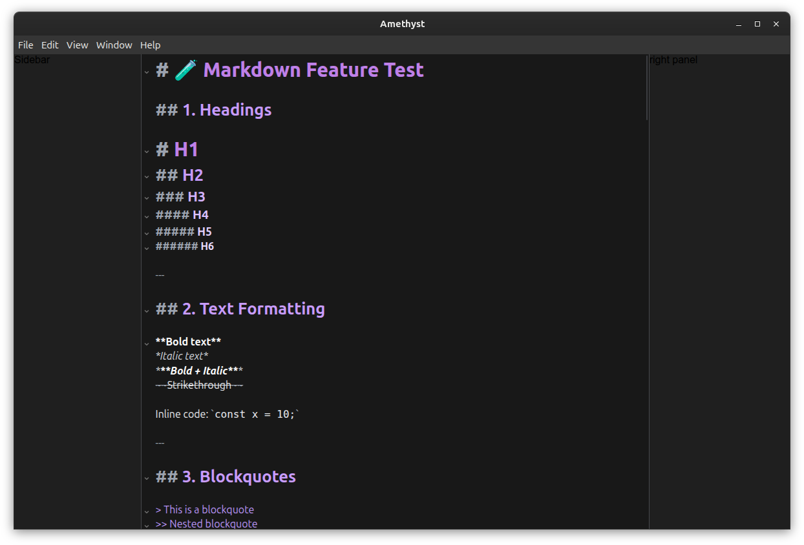
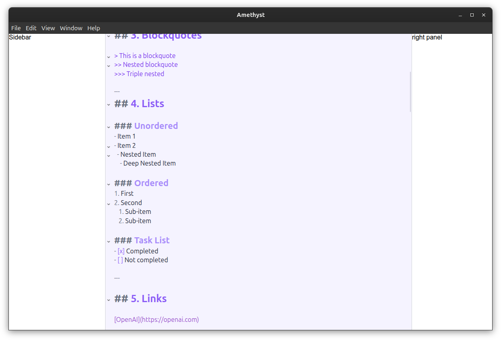

# Amethyst

A modern markdown note-taking desktop application built with Electron, React, Vite, and TypeScript.

Amethyst is currently in early development. The current `v0.1.0` milestone focuses on the editor foundation: a working desktop shell, a CodeMirror-based editor, a resizable three-panel layout, and a basic built-in theme/settings pipeline.

## Current status

Amethyst is currently in early development.
Version 0.1.0 includes the editor foundation and application architecture.
Notes, notebooks, preview, and split view will be added in future releases.

**Released:** `v0.1.0`

What currently works:

- Electron desktop shell
- React renderer with Vite
- CodeMirror editor integration
- Resizable left / center / right workspace panels
- Collapsible side panels
- Built-in dark and light theme loading
- Settings persistence infrastructure
- GitHub Actions CI and tagged release workflow

What is not implemented yet:

- Notes and notebooks
- Saving markdown files
- Preview pane
- Split editor/preview view
- Search
- Outline panel contents
- Full settings UI

## Screenshots




## Tech stack

| Layer         | Technology                  |
| ------------- | --------------------------- |
| Desktop shell | Electron                    |
| Renderer      | React                       |
| Build tool    | Vite                        |
| Language      | TypeScript                  |
| Editor        | CodeMirror 6                |
| Layout        | react-resizable-panels      |
| Styling       | CSS variables + JSON themes |
| Packaging     | electron-builder            |

## Project structure

```text
amethyst/
├── assets/                # Icons and packaging assets
├── electron/              # Electron main process, preload, IPC, native-side services
│   ├── ipc/               # IPC handler registration
│   ├── services/          # Settings/theme services on the main process
│   ├── themes/            # Built-in JSON theme definitions
│   └── window/            # BrowserWindow creation
├── shared/                # Types shared by main and renderer
├── src/                   # React renderer application
│   ├── app/               # App bootstrap and root app component
│   ├── features/          # Feature modules (editor, sidebar, right panel, workspace)
│   ├── layout/            # App shell and panel layout composition
│   ├── services/          # Renderer-side IPC client wrappers
│   ├── styles/            # Global and layout CSS
│   └── utils/             # Small DOM/UI helpers
├── .github/workflows/     # CI and release automation
├── package.json
└── vite.config.ts
```

## How the app is structured

Amethyst follows a simple Electron architecture:

- **Main process** creates the native window, owns filesystem access, and persists settings.
- **Preload** exposes a narrow, safe API to the renderer through `window.amethyst`.
- **Renderer** contains the React UI and talks to the main process only through IPC wrappers.
- **Shared types** keep the contract between both sides aligned.

For more detail, see [ARCHITECTURE.md](./ARCHITECTURE.md).

## Development

### Install dependencies

```bash
npm install
```

### Run in development

```bash
npm run dev
```

This starts:

- the Vite development server for the renderer
- Electron, pointed at the Vite dev URL through `ELECTRON_START_URL`

### Run checks

```bash
npm run check
```

This runs type-checking, linting, formatting checks, and a production build.

## Build and package

### Build renderer + Electron main code

```bash
npm run build
```

### Build installable packages

```bash
npm run build:electron
```

This packages the app with `electron-builder`.

Current targets:

- **Windows:** NSIS installer, portable executable
- **macOS:** DMG, ZIP
- **Linux:** AppImage, DEB, RPM, tar.gz

## Available scripts

| Script                       | Description                                              |
| ---------------------------- | -------------------------------------------------------- |
| `npm run dev`                | Start Vite and Electron together for local development   |
| `npm run build`              | Build the renderer and Electron TypeScript output        |
| `npm run build:electron`     | Create packaged desktop release artifacts                |
| `npm run build:electron:dir` | Build unpacked output for inspection/debugging           |
| `npm run preview`            | Preview the Vite production renderer build               |
| `npm run lint`               | Run ESLint                                               |
| `npm run lint:fix`           | Run ESLint and apply fixes where possible                |
| `npm run format`             | Format the repository with Prettier                      |
| `npm run format:check`       | Check formatting with Prettier                           |
| `npm run typecheck`          | Type-check both renderer and Electron TypeScript configs |
| `npm run check`              | Run typecheck + lint + format check + build              |

## Themes

Amethyst already has a small theme system.

Current built-in themes:

- `amethyst-dark`
- `amethyst-light`

Themes are defined as JSON files in `electron/themes/` and applied in the renderer by mapping theme tokens to CSS custom properties.

Longer term, this can grow into a custom-theme system without changing the basic contract.

## Settings

The project already includes a basic settings persistence layer.

Current stored settings:

- selected theme
- autosave flag

Settings are stored in the Electron `userData` directory as `settings.json`.

The settings model is intentionally small right now because the settings UI has not been built yet.

## Storage

### Current

- **Settings:** stored in the app's `userData/settings.json`
- **Themes:** built-in JSON files bundled with the app
- **Notes:** not implemented yet

### Planned

Once note storage is added, markdown notes and notebook metadata will likely live in a user-chosen local directory while app-level preferences remain in `userData`.

## Documentation

- [CHANGELOG.md](./CHANGELOG.md)
- [ROADMAP.md](./ROADMAP.md)
- [ARCHITECTURE.md](./ARCHITECTURE.md)

## Contributing

Contributions are welcome later, but the project is still in early architecture-first development.

If you want to contribute once the project stabilizes:

1. Fork the repository.
2. Create a feature branch.
3. Keep changes focused and small.
4. Run `npm run check` before opening a pull request.
5. Explain the change clearly in the PR description.

## License

Amethyst is licensed under the **AGPL-3.0-or-later** license. See [LICENSE](./LICENSE).

## Author

**Abdallah Mohammad**

- GitHub: `abdallah-moh1`
- Email: `abdallah.moh.q@gmail.com`
