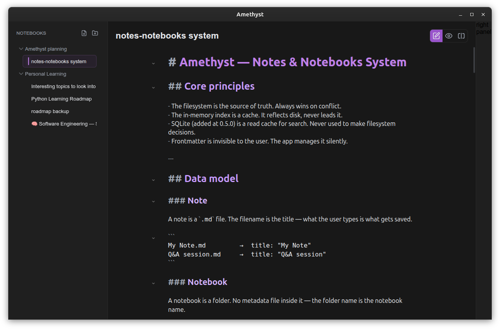

# 💎 Amethyst


A streamlined, architecture-first Markdown note-taking desktop application built with **Electron, React, Vite, and TypeScript**.

Amethyst is currently in active early development. The latest `v0.4.0` milestone introduces **Facets** (single-workspace management) with a recursive filesystem tree view.

---

## 🚀 Current Status (`v0.4.0`)

What currently works:

- **Single-Facet Workspace:** Support for a single local root directory (currently set to a fixed default path for development).
- **Recursive Tree View:** Hierarchical navigation of folders (notebooks) and files (notes) within the active Facet.
- **Real-time Sync:** Main-process filesystem watching (Chokidar) to reflect external changes instantly in the UI.
- **Editor:** CodeMirror 6 integration with tab-less, single-note focused loading.
- **Preview:** Live Markdown-to-HTML rendering with toggle and split-view modes.
- **Theming:** Built-in dark and light theme loading via CSS variables and JSON.
- **Infrastructure:** Settings persistence and GitHub Actions CI/CD workflows for multi-platform releases.

> **Note:** Synchronized scrolling has been temporarily removed in v0.4.0 to undergo a high-performance refactor scheduled for v0.9.0.

## 📸 Screenshots




## 🛠️ Tech Stack

| Layer         | Technology                  |
| ------------- | --------------------------- |
| Desktop Shell | Electron                    |
| Renderer      | React                       |
| Build Tool    | Vite                        |
| Language      | TypeScript                  |
| Editor        | CodeMirror 6                |
| Layout        | react-resizable-panels      |
| Styling       | CSS variables + JSON themes |
| Packaging     | electron-builder            |

## 📂 Project Structure

```text
amethyst/
├── assets/                # Icons and packaging assets
├── electron/              # Electron main process, preload, IPC, native-side services
│   ├── ipc/               # IPC handler registration
│   ├── services/          # Settings, theme, and filesystem services
│   ├── themes/            # Built-in JSON theme definitions
│   └── window/            # BrowserWindow creation
├── shared/                # Types shared by main and renderer
├── src/                   # React renderer application
│   ├── app/               # App bootstrap and root app component
│   ├── features/          # Feature modules (editor, sidebar/tree, workspace)
│   ├── layout/            # App shell and panel layout composition
│   ├── services/          # Renderer-side IPC client wrappers
│   └── styles/            # Global and layout CSS
├── .github/workflows/     # CI and release automation
├── package.json
└── vite.config.ts
```

## 🏗️ Architecture

Amethyst follows a strict, secure Electron architecture:

- **Main Process:** Manages native windows, recursive filesystem scanning, and real-time file watching.
- **Preload:** Exposes a narrow, secure API to the renderer through `window.amethyst`.
- **Renderer:** Contains the React UI and communicates via IPC wrappers to maintain a clean separation of concerns.
- **Shared Types:** Keeps the contract between the main process and renderer strictly aligned.

## 💻 Development

### 1\. Install Dependencies

```bash
npm install
```

### 2\. Run Locally

```bash
npm run dev
```

### 3\. Run Checks

```bash
npm run check
```

## 📦 Build and Package

| Command                  | Description                                         |
| ------------------------ | --------------------------------------------------- |
| `npm run build`          | Builds the renderer and Electron TypeScript output. |
| `npm run build:electron` | Packages the app into desktop release artifacts.    |

**Current Packaging Targets:**

- **Windows:** NSIS installer, portable executable
- **macOS:** DMG, ZIP
- **Linux:** AppImage, DEB, RPM, tar.gz

## 💾 Storage

- **Settings:** Stored in the app's `userData/settings.json`.
- **Notes (Facets):** Currently targets a **fixed default path** for development. Native directory selection via the system dialog is scheduled for v0.5.0.

## 📚 Documentation

- [ROADMAP.md](./ROADMAP.md) - Release schedule and feature tracking.
- [PROJECT_PLAN.md](./PROJECT_PLAN.md) - Technical milestone checklist.
- [ARCHITECTURE.md](./ARCHITECTURE.md) - Technical deep dive.

## 🤝 Contributing

Contributions are welcome\! Please see [CONTRIBUTING.md](./CONTRIBUTING.md) for guidelines.

## 👨‍💻 Author

**Abdallah Mohammad**

- GitHub: [abdallah-moh1](https://www.google.com/search?q=https://github.com/abdallah-moh1)
- Email: `abdallah.moh.q@gmail.com`

## 📄 License

Amethyst is licensed under the **AGPL-3.0-or-later** license. See [LICENSE](https://www.google.com/search?q=./LICENSE).
