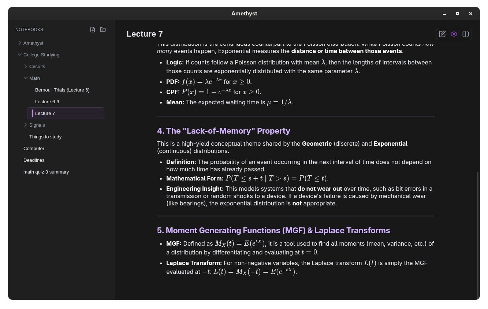

# Amethyst


A local markdown note-taking app built with Electron and React. No cloud, no accounts, just your files.

> [!NOTE]
> Amethyst is still in beta, it is still under development features are still being added regularly. Some functionality may be incomplete or subject to change between releases.



## Features

- Split editor and preview, updates as you type. LaTeX math works.
- Auto-saves every 2 seconds, saves on note switch too
- Sidebar file tree, folders sort above notes
- One note open at a time, no tabs
- Rename, move, delete files. Deletes go to a local `.trash` folder so nothing is permanent. (No trash UI in the sidebar yet)
- Keyboard shortcuts and right-click menus for most things
- Notes currently save to `$HOME/.amethyst` by default. Support for multiple "Facets" (vaults) with custom paths is coming soon

## Installation

Download the latest release from the [releases page](https://github.com/abdallah-moh1/amethyst/releases):

| Platform | Format                                            |
| -------- | ------------------------------------------------- |
| Windows  | NSIS installer or portable `.exe`                 |
| macOS    | `.dmg` or `.zip`                                  |
| Linux    | `.AppImage`, `.deb`, `.rpm`, `.pacman`, `.tar.gz` |

Or build from [source below](#building-from-source).

## Development

Requires Node.js and npm.

```bash
git clone https://github.com/abdallah-moh1/amethyst.git
cd amethyst
npm install
npm run dev
```

| Command             | Description          |
| ------------------- | -------------------- |
| `npm run dev`       | Start in dev mode    |
| `npm run lint`      | Run ESLint           |
| `npm run lint:fix`  | ESLint with auto-fix |
| `npm run format`    | Run Prettier         |
| `npm run typecheck` | TypeScript check     |
| `npm run check`     | Run all checks       |

## Building from source

```bash
npm run build:electron        # build for your current platform
npm run build:electron:dir    # build into a directory, no installer
```

Output goes to `dist/`.

## What is coming?

You can check the project's [current roadmap](./ROADMAP.md)

> [!NOTE]
> The roadmap is subject to change. If you'd like to see a specific feature added to Amethyst, feel free to open an issue with the `feature-request` label and describe your idea!

## License

[AGPL-3.0-or-later](LICENSE)
