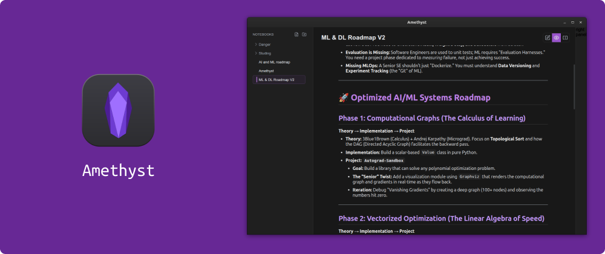
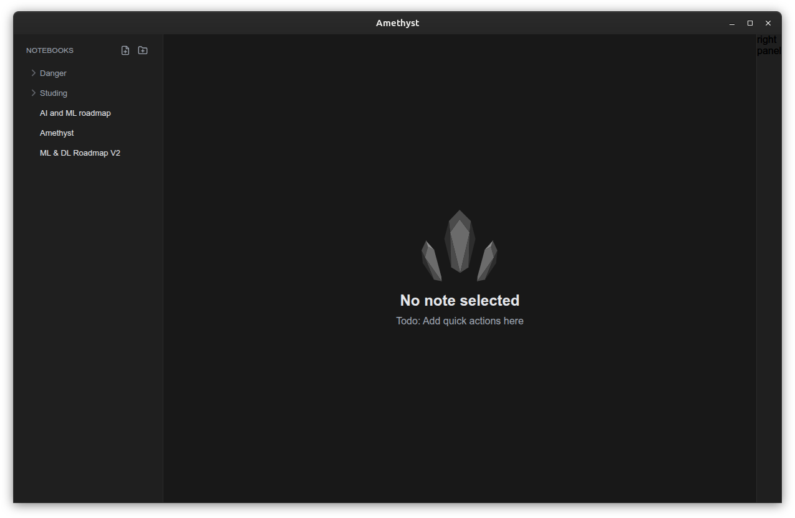
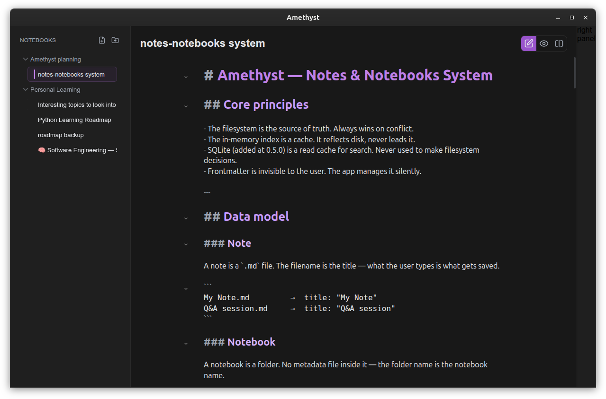

# Amethyst


A streamlined, architecture-first Markdown note-taking desktop application built with **Electron, React, Vite, and TypeScript**.

---

## 🚀 Current Status (`v0.5.7`)

What currently works:

- **Single-Facet Workspace:** Support for a single local root directory.
- **Recursive Tree View:** Hierarchical navigation with **Drag & Drop** support to rearrange notes and notebooks.
- **Command & Shortcut System:** A robust internal command registry with a centralized keyboard shortcut manager for high-speed navigation.
- **Context Menus:** Right-click support for notes, notebooks, and sidebar areas for quick actions (rename, delete, create).
- **Editor:** CodeMirror 6 integration with **Header Renaming** (click the title in the workspace header to rename).
- **Preview:** Live Markdown-to-HTML rendering with **LaTeX Math support** and scrollable tables.
- **Empty State & Onboarding:** A polished "Empty State" view when no note is selected and a built-in **Welcome Note** for new users.
- **Notifications:** A global **Toast Notification** system providing real-time feedback on app actions.
- **Real-time Sync:** Main-process filesystem watching (Chokidar) to reflect external changes instantly in the UI.
- **Trash Reliability:** Improved `.trash` handling with unique trash destinations on Windows and fixed empty notebook delete failures.
- **Theming:** Built-in dark and light theme loading via CSS variables and JSON.

> **Note:** Synchronized scrolling has been temporarily removed in v0.4.0 to undergo a high-performance refactor scheduled for v0.9.0.

## 📸 Screenshots





## 🛠️ Tech Stack

| Layer          | Technology                  |
| -------------- | --------------------------- |
| Desktop Shell  | Electron                    |
| Renderer       | React                       |
| Build Tool     | Vite                        |
| Language       | TypeScript                  |
| Editor         | CodeMirror 6                |
| Math Rendering | LaTeX                       |
| Layout         | react-resizable-panels      |
| Styling        | CSS variables + JSON themes |
| Packaging      | electron-builder            |

## 📂 Project Structure

```text
amethyst/
├── assets/
├── electron/
│   ├── features/
│   ├── ipc/
│   ├── services/
│   ├── themes/
│   ├── utils/
│   ├── window/
│   ├── main.ts
│   └── preload.mts
├── screenshots/
├── shared/
│   └── types/
├── src/
│   ├── app/
│   ├── core/
│   │   ├── commands/
│   │   ├── editor/
│   │   ├── keybindings/
│   │   └── markdown/
│   ├── features/
│   │   ├── context-menu/
│   │   ├── empty-state/
│   │   ├── facet-tree/
│   │   ├── notebooks/
│   │   ├── note-editor/
│   │   ├── note-preview/
│   │   ├── notes/
│   │   ├── right-panel/
│   │   ├── sidebar/
│   │   ├── theme/
│   │   ├── toast-notifications/
│   │   └── workspace/
│   ├── infrastructure/
│   │   ├── clients/
│   ├── layout/
│   ├── shared/
│   │   ├── assets/
│   │   ├── hooks/
│   │   ├── types/
│   │   └── utils/
│   ├── store/
│   ├── styles/
│   ├── global.d.ts
│   ├── main.tsx
│   └── vite-env.d.ts
├── ARCHITECTURE.md
├── CHANGELOG.md
├── CONTRIBUTING.md
├── eslint.config.js
├── index.html
├── LICENSE
├── package.json
├── package-lock.json
├── README.md
├── RELEASE_NOTES.md
├── ROADMAP.md
├── tsconfig.json
├── tsconfig.node.json
└── vite.config.ts
```

## 🏗️ Architecture

Amethyst follows a strict, secure Electron architecture:

- **Main Process:** Manages native windows, recursive filesystem scanning, and real-time file watching.
- **Preload:** Exposes a narrow, secure API to the renderer through `window.amethyst`.
- **Command Registry:** Centralized logic for executing app actions consistently via shortcuts, menus, or UI buttons.
- **Renderer:** Contains the React UI and communicates via IPC wrappers to maintain a clean separation of concerns.
- **Shared Types:** Keeps the contract between the main process and renderer strictly aligned.

## 💻 Development

### 1. Install Dependencies

```bash
npm install
```

### 2. Run Locally

```bash
npm run dev
```

### 3. Run Checks

```bash
npm run check
```

## 📦 Build and Package

| Command                  | Description                                         |
| ------------------------ | --------------------------------------------------- |
| `npm run build`          | Builds the renderer and Electron TypeScript output. |
| `npm run build:electron` | Packages the app into desktop release artifacts.    |

**Current Packaging Targets:**

- **Windows:** NSIS installer, portable executable
- **macOS:** DMG, ZIP
- **Linux:** AppImage, DEB, RPM, pacman (Arch), tar.gz

## ⌨️ Shortcuts

| Shortcut       | Action                           |
| -------------- | -------------------------------- |
| `Ctrl+S`       | Save the current active note     |
| `Ctrl+N`       | Create a new note                |
| `Ctrl+Shift+N` | Create a new notebook            |
| `Delete`       | Delete selected note or notebook |
| `F2`           | Rename selected note or notebook |

## 💾 Storage

- **Settings:** Stored in the app's `userData/settings.json`.
- **Notes (Facets):** Currently targets a **fixed default path** for development. Native directory selection via the system dialog is scheduled for v0.5.0.

## 📚 Documentation

- [ROADMAP.md](./ROADMAP.md) - Release schedule and feature tracking.
- [ARCHITECTURE.md](./ARCHITECTURE.md) - Technical deep dive.

## 🤝 Contributing

Contributions are welcome! Please see [CONTRIBUTING.md](./CONTRIBUTING.md) for guidelines.

## 👨‍💻 Author

**Abdallah Mohammad**

- GitHub: [abdallah-moh1](https://github.com/abdallah-moh1)
- Email: `abdallah.moh.q@gmail.com`

## 📄 License

Amethyst is licensed under the **AGPL-3.0-or-later** license. See [LICENSE](./LICENSE).
